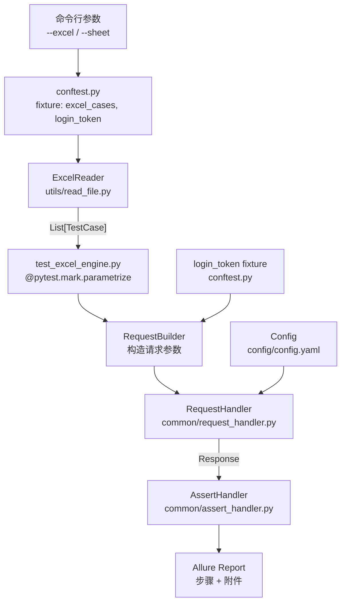

# 技术设计文档：Excel 驱动接口测试引擎

## Overview

本设计将现有 pytest + allure 框架从硬编码的单接口测试改造为通用的 Excel 驱动接口测试引擎。

核心思路：**Excel 即测试用例**。测试工程师只需维护 Excel 文件，框架自动完成用例解析、请求发送、断言比对、报告生成，无需修改任何 Python 代码。

改造范围：
- 增强 `utils/read_file.py` 中的 `ExcelReader`，支持 JSON 字段解析、`is_run` 过滤、`expected_` 前缀自动识别
- 重构 `common/assert_handler.py`，支持多字段动态断言
- 新增 `testcases/test_excel_engine.py`，作为通用测试驱动入口
- 新增 `conftest.py` 中的 `--excel` / `--sheet` 命令行参数注册

现有组件保持不变：`RequestHandler`、`log_handler`、`Config`、`login_token` fixture。

---

## Architecture



**数据流：**
1. pytest 启动时读取 `--excel` / `--sheet` 参数
2. `excel_cases` fixture 调用 `ExcelReader` 解析 Excel，返回 `List[TestCase]`
3. `@pytest.mark.parametrize` 将每条 `TestCase` 展开为独立测试函数
4. 每条测试：构造请求参数 → 发送请求 → 多字段断言 → 写入 Allure 步骤

---

## Components and Interfaces

### 1. ExcelReader（增强）

文件：`utils/read_file.py`

```python
class ExcelReader:
    RESERVED_COLUMNS: set[str] = {
        "case_id", "title", "method", "url",
        "headers", "params", "body", "type",
        "run_status", "is_run"
    }
    JSON_COLUMNS: set[str] = {"headers", "params", "body"}
    REQUIRED_COLUMNS: set[str] = {"method", "url"}

    def __init__(self, file_path: str, sheet_name: str = "Sheet1") -> None: ...

    def load_cases(self) -> list[dict]: ...
    # 返回过滤后的 TestCase 列表，每条为字典：
    # {
    #   "case_id": str, "title": str, "method": str, "url": str,
    #   "headers": dict | None, "params": dict | None,
    #   "body": dict | None, "type": str | None,
    #   "run_status": bool,
    #   "expected": {"code": "200", "msg": "成功", ...}  # expected_ 前缀列
    # }

    def _parse_json_field(self, value: str | None, row: int, col: str) -> dict | None: ...
    def _parse_run_status(self, value: str | bool | None) -> bool: ...
    def _validate_headers(self, headers: list[str]) -> None: ...
```

**关键行为：**
- `is_run` 列值不为 `TRUE`（大小写不敏感）时跳过该行
- `expected_` 前缀列统一收集到 `expected` 子字典，去掉前缀作为 key
- `headers`/`params`/`body` 为 `None` 或空字符串时返回 `None`，不抛异常
- JSON 解析失败时抛出 `ValueError(f"第{row}行 {col} 列 JSON 解析失败: {value}")`

---

### 2. AssertHandler（重构）

文件：`common/assert_handler.py`

```python
class AssertHandler:
    @staticmethod
    def assert_response(
        response: requests.Response,
        expected: dict[str, Any]
    ) -> None: ...
    # 遍历 expected 字典，对每个 key 从响应 JSON 中取同名字段比对
    # expected_code 特殊处理：与 response.status_code 比对

    @staticmethod
    def _coerce_value(expected: Any, actual: Any) -> tuple[Any, Any]: ...
    # 类型自动转换：期望值为数字字符串时转为 int/float 再比对
```

**断言逻辑：**
```
expected = {"code": "200", "msg": "成功"}
→ assert response.status_code == 200          # code 特殊处理
→ assert response.json()["msg"] == "成功"     # 其余字段从响应 JSON 取值
```

---

### 3. 通用测试驱动入口

文件：`testcases/test_excel_engine.py`

```python
def pytest_generate_tests(metafunc):
    # 动态参数化：从 excel_cases fixture 读取用例列表

@pytest.mark.usefixtures("login_token")
def test_api_case(case: dict, login_token: str, request) -> None:
    # 1. allure.dynamic.title(f"{case['case_id']} - {case['title']}")
    # 2. 构造请求参数（注入 token、合并 headers）
    # 3. RequestHandler.send_request(...)
    # 4. AssertHandler.assert_response(response, case["expected"])
```

---

### 4. conftest.py 扩展

新增内容（不破坏现有 `login_token` fixture）：

```python
def pytest_addoption(parser):
    parser.addoption("--excel", default="testcases/autotest_case.xlsx")
    parser.addoption("--sheet", default="Sheet1")

@pytest.fixture(scope="session")
def excel_cases(request) -> list[dict]:
    excel_path = request.config.getoption("--excel")
    sheet_name = request.config.getoption("--sheet")
    return ExcelReader(excel_path, sheet_name).load_cases()
```

---

## Data Models

### TestCase 字典结构

```python
TestCase = TypedDict("TestCase", {
    "case_id":    str,
    "title":      str,
    "method":     str,           # GET / POST / PUT / DELETE / PATCH
    "url":        str,           # 接口路径，如 /api/user/list
    "headers":    dict | None,   # 自定义请求头，已解析为字典
    "params":     dict | None,   # GET 查询参数，已解析为字典
    "body":       dict | None,   # POST 请求体，已解析为字典
    "type":       str | None,    # 编码方式，如 "json"
    "run_status": bool,          # True = 携带 token
    "expected":   dict[str, str] # {"code": "200", "msg": "成功"}
})
```

### Excel 列映射

| Excel 列 | 字段名 | 类型 | 说明 |
|---------|--------|------|------|
| A | case_id | str | 用例编号 |
| B | title | str | 用例标题 |
| C | method | str | HTTP 方法 |
| D | url | str | 接口路径 |
| E | headers | JSON→dict | 自定义请求头 |
| F | params | JSON→dict | GET 查询参数 |
| G | body | JSON→dict | POST 请求体 |
| H | type | str | 编码方式（json） |
| I | run_status | TRUE/FALSE→bool | 是否携带 token |
| J | expected_code | str | 期望响应码 |
| K | expected_msg | str | 期望响应消息 |
| ... | expected_* | str | 其他断言字段 |
| 可选 | is_run | TRUE/FALSE | 是否执行该用例 |

### 请求构造规则

```
full_url   = Config.base_url + case["url"]
req_kwargs = {}

if case["params"]:   req_kwargs["params"] = case["params"]
if case["body"]:
    if case["type"] == "json": req_kwargs["json"] = case["body"]
    else:                      req_kwargs["data"] = case["body"]

merged_headers = {}
if case["run_status"] and "Authorization" not in (case["headers"] or {}):
    merged_headers["Authorization"] = f"Bearer {login_token}"
if case["headers"]:
    merged_headers.update(case["headers"])
if merged_headers:
    req_kwargs["headers"] = merged_headers
```

---

## Correctness Properties


*属性（Property）是在系统所有合法执行中都应成立的特征或行为——本质上是对系统应做什么的形式化陈述。属性是人类可读规范与机器可验证正确性保证之间的桥梁。*

### Property 1：JSON 列往返解析

*对于任意* 合法字典值，将其序列化为 JSON 字符串后写入 Excel 的 `headers`、`params` 或 `body` 列，ExcelReader 解析后应得到与原始字典等价的结果。

**Validates: Requirements 1.4, 1.5, 1.6**

---

### Property 2：is_run 过滤

*对于任意* 包含 `is_run` 列的用例列表，ExcelReader 返回的结果中不应包含任何 `is_run` 值不为 `TRUE`（大小写不敏感）的行。

**Validates: Requirements 1.2**

---

### Property 3：expected_ 前缀列自动识别

*对于任意* Excel 表头组合，所有以 `expected_` 为前缀的列都应被收集到 `expected` 子字典中（去掉前缀作为 key），且非 `expected_` 列不应出现在 `expected` 子字典中。

**Validates: Requirements 1.3**

---

### Property 4：run_status 布尔解析

*对于任意* 字符串值，ExcelReader 解析 `run_status` 列时，当且仅当该值大小写不敏感等于 `"TRUE"` 时返回 `True`，其余所有值（包括 `"FALSE"`、空值、其他字符串）返回 `False`。

**Validates: Requirements 1.8**

---

### Property 5：文件不存在时抛出 FileNotFoundError

*对于任意* 不存在的文件路径，ExcelReader 初始化时应抛出 `FileNotFoundError`，且异常消息中包含该路径字符串。

**Validates: Requirements 1.9**

---

### Property 6：非法 JSON 字段抛出 ValueError

*对于任意* 非空且无法解析为合法 JSON 的字符串，当其出现在 `headers`、`params` 或 `body` 列时，ExcelReader 应抛出 `ValueError`，且异常消息包含行号和列名。

**Validates: Requirements 1.10**

---

### Property 7：必填列为空时抛出 ValueError

*对于任意* `method` 或 `url` 列值为空的行，ExcelReader 应抛出 `ValueError`，且异常消息包含行号和对应列名。

**Validates: Requirements 1.11**

---

### Property 8：token 注入与优先级

*对于任意* `run_status=True` 的 TestCase 和任意 `login_token` 值，构造的请求头中应包含 `Authorization: Bearer {login_token}`；若 TestCase 的 `headers` 中已包含 `Authorization` 字段，则应优先使用 `headers` 中的值，不被 `login_token` 覆盖。

**Validates: Requirements 2.4, 2.5**

---

### Property 9：URL 拼接

*对于任意* `url` 路径字符串，构造的完整请求地址应等于 `Config.base_url + url`，不多不少。

**Validates: Requirements 2.6**

---

### Property 10：非法 HTTP 方法抛出 ValueError

*对于任意* 不在 `[GET, POST, PUT, DELETE, PATCH]` 范围内的 method 值，RequestHandler 应抛出 `ValueError`，且异常消息包含该实际值。

**Validates: Requirements 2.7**

---

### Property 11：多字段断言正确性

*对于任意* 响应 JSON 和期望值字典，AssertHandler 对每个期望字段的断言结果应与直接比较 `response.json()[field] == expected[field]` 的结果一致；当期望值为数字字符串时，应与响应中的数字类型进行等值比较。

**Validates: Requirements 3.2, 3.6**

---

### Property 12：断言失败信息完整性

*对于任意* 字段名、期望值和不匹配的实际值，AssertHandler 断言失败时的错误信息应同时包含字段名、期望值和实际值这三个要素。

**Validates: Requirements 3.3**

---

### Property 13：缺失字段断言失败

*对于任意* 在响应 JSON 中不存在的期望字段名，AssertHandler 应断言失败，且错误信息包含该缺失字段名。

**Validates: Requirements 3.5**

---

### Property 14：空值字段忽略

*对于任意* `headers`、`params`、`body` 列值为 `None` 或空字符串的 TestCase，ExcelReader 解析后对应字段应为 `None`，不应返回空字典。

**Validates: Requirements 5.3**

---

### Property 15：Excel 往返等价性

*对于任意* 符合规范的 TestCase 列表，将其序列化为 Excel 文件后再由 ExcelReader 解析，所得结果应与原始列表等价。

**Validates: Requirements 5.4**

---

### Property 16：多 Sheet 独立解析

*对于任意* 包含多个 Sheet 的 Excel 文件，对不同 Sheet 名称调用 ExcelReader 应分别返回对应 Sheet 的用例列表，互不干扰。

**Validates: Requirements 4.6**

---

## Error Handling

### ExcelReader 错误处理

| 错误场景 | 异常类型 | 消息格式 |
|---------|---------|---------|
| 文件路径不存在 | `FileNotFoundError` | `"Excel 文件不存在: {file_path}"` |
| Sheet 名称不存在 | `KeyError` | `"Sheet '{sheet_name}' 不存在，可用 Sheet: {sheets}"` |
| JSON 列解析失败 | `ValueError` | `"第{row}行 {col} 列 JSON 解析失败: {value}"` |
| 必填列值为空 | `ValueError` | `"第{row}行 {col} 列不能为空"` |
| 缺少必填列 | `ValueError` | `"Excel 缺少必填列: {missing_cols}"` |

### AssertHandler 错误处理

| 错误场景 | 处理方式 |
|---------|---------|
| 响应体非 JSON | `pytest.fail(f"响应体无法解析为 JSON，原始内容: {response.text}")` |
| 期望字段不存在于响应 | `pytest.fail(f"响应 JSON 中缺少字段: {field}")` |
| 字段值不匹配 | `pytest.fail(f"字段 {field} 断言失败: 期望 {expected}, 实际 {actual}")` |

### RequestHandler 错误处理

| 错误场景 | 处理方式 |
|---------|---------|
| 非法 HTTP 方法 | 抛出 `ValueError(f"不支持的 HTTP 方法: {method}")` |
| 网络异常/超时 | 记录 ERROR 日志后重新抛出，用例标记为 FAILED |

---

## Testing Strategy

### 双轨测试策略

本引擎采用**单元测试 + 属性测试**双轨并行的方式，两者互补：

- **单元测试**：验证具体示例、边界条件、错误场景
- **属性测试**：验证对所有合法输入都成立的普遍规律

### 属性测试配置

使用 `hypothesis` 库（Python 属性测试标准库）：

```bash
pip install hypothesis
```

每个属性测试最少运行 **100 次**随机输入迭代。每个属性测试必须通过注释标注对应的设计属性：

```python
# Feature: excel-driven-api-test-engine, Property 1: JSON 列往返解析
@given(st.dictionaries(st.text(), st.text()))
@settings(max_examples=100)
def test_json_column_roundtrip(data):
    ...
```

### 测试文件结构

```
tests/
├── unit/
│   ├── test_excel_reader.py       # ExcelReader 单元测试（错误场景、示例）
│   ├── test_assert_handler.py     # AssertHandler 单元测试
│   └── test_request_builder.py    # 请求构造逻辑单元测试
└── property/
    ├── test_excel_reader_props.py  # Properties 1-4, 14-16
    ├── test_assert_handler_props.py # Properties 11-13
    └── test_request_builder_props.py # Properties 8-10
```

### 属性测试覆盖矩阵

| 属性 | 测试文件 | Hypothesis 策略 |
|-----|---------|----------------|
| P1 JSON 往返 | test_excel_reader_props.py | `st.dictionaries(st.text(), st.text())` |
| P2 is_run 过滤 | test_excel_reader_props.py | `st.lists(st.fixed_dictionaries(...))` |
| P3 expected_ 识别 | test_excel_reader_props.py | `st.lists(st.text().filter(...))` |
| P4 run_status 解析 | test_excel_reader_props.py | `st.text()` |
| P5 文件不存在 | test_excel_reader_props.py | `st.text()` (随机路径) |
| P6 非法 JSON | test_excel_reader_props.py | `st.text().filter(非法 JSON)` |
| P7 必填列为空 | test_excel_reader_props.py | `st.none()` |
| P8 token 注入 | test_request_builder_props.py | `st.text()` (token), `st.booleans()` |
| P9 URL 拼接 | test_request_builder_props.py | `st.text()` (url path) |
| P10 非法方法 | test_request_builder_props.py | `st.text().filter(非法方法)` |
| P11 多字段断言 | test_assert_handler_props.py | `st.dictionaries(...)` |
| P12 失败信息 | test_assert_handler_props.py | `st.text(), st.integers()` |
| P13 缺失字段 | test_assert_handler_props.py | `st.text()` (字段名) |
| P14 空值忽略 | test_excel_reader_props.py | `st.none() \| st.just("")` |
| P15 Excel 往返 | test_excel_reader_props.py | `st.lists(st.fixed_dictionaries(...))` |
| P16 多 Sheet | test_excel_reader_props.py | `st.lists(...)` × 2 |

### 单元测试重点

单元测试聚焦以下场景（避免与属性测试重复）：

1. **集成示例**：完整的 Excel → 请求 → 断言 端到端流程
2. **命令行参数默认值**：`--excel` 默认 `testcases/autotest_case.xlsx`，`--sheet` 默认 `Sheet1`
3. **网络异常传播**：mock `requests.Session.request` 抛出 `ConnectionError`，验证异常被重新抛出
4. **非 JSON 响应体**：mock 响应体为纯文本，验证 AssertHandler 的错误处理
5. **Allure 步骤记录**：mock `allure.step`，验证关键信息被记录

### 运行命令

```bash
# 单元测试
pytest tests/unit/ -v

# 属性测试
pytest tests/property/ -v --hypothesis-seed=0

# 完整测试套件（含 Excel 驱动集成测试）
pytest testcases/test_excel_engine.py --excel=testcases/autotest_case.xlsx --sheet=Sheet1 -v --alluredir=reports/allure-results

# 生成 Allure 报告
allure serve reports/allure-results
```
